# AeroTwin-X: AI-Enabled Real-Time Digital Twin for Aero-Piston MALE UAV Engines

[](https://fastapi.tiangolo.com)
[](https://www.python.org/)
[](https://scikit-learn.org/)
[](https://threejs.org/)
[](https://tailwindcss.com/)
[](#license)

> **Operational Notice:** AeroTwin-X is an advanced conceptual software demonstrator and flight test bench digital twin engineered for Medium-Altitude Long-Endurance (MALE) UAV propulsion systems (turbocharged Rotax 915iSc class). It demonstrates continuous physics synchronization, anomaly detection, multi-class failure diagnosis, and condition-based predictive maintenance. It is **not** certified flight-critical avionics software.

---

## Table of Contents
1. [Project Overview & Objectives](#1-project-overview--objectives)
2. [End-to-End System Architecture](#2-end-to-end-system-architecture)
3. [User Interface & Dashboard Modules (with Screenshots)](#3-user-interface--dashboard-modules)
   - [01. Mission Control & Master Overview](#01-mission-control--master-overview)
   - [02. Live Sensor Telemetry & CAN Bus Matrix](#02-live-sensor-telemetry--can-bus-matrix)
   - [03. 3D Engine Digital Twin & Thermal FEA](#03-3d-engine-digital-twin--thermal-fea)
   - [04. AI Diagnostics & Fault Prediction](#04-ai-diagnostics--fault-prediction)
   - [05. RUL & Engine Degradation Corridor](#05-rul--engine-degradation-corridor)
   - [06. Alerts & Events Center](#06-alerts--events-center)
   - [07. Predictive Maintenance & CBM+ Workspace](#07-predictive-maintenance--cbm-workspace)
   - [08. Mission Simulator & Flight Propulsion Emulation](#08-mission-simulator--flight-propulsion-emulation)
   - [09. Mission Replay & Historical Telemetry Analysis](#09-mission-replay--historical-telemetry-analysis)
   - [10. Master Control Center & Fault Injection Cockpit](#10-master-control-center--fault-injection-cockpit)
   - [11. Edge AI Monitoring & Data Integrity](#11-edge-ai-monitoring--data-integrity)
   - [12. System Architecture & Telemetry Pipeline](#12-system-architecture--telemetry-pipeline)
   - [13. About AeroTwin-X & Engineering Standards](#13-about-aerotwin-x--engineering-standards)
4. [Digital Twin Mathematical & Physics Models](#4-digital-twin-mathematical--physics-models)
5. [AI / ML Architecture & Explainability (XAI)](#5-ai--ml-architecture--explainability-xai)
6. [Fault Injection Engine & Supported Scenarios](#6-fault-injection-engine--supported-scenarios)
7. [Comprehensive Telemetry Parameter Dictionary](#7-comprehensive-telemetry-parameter-dictionary)
8. [How to Run the Project in the Future](#8-how-to-run-the-project-in-the-future)
9. [API Reference & WebSocket Specs](#9-api-reference--websocket-specs)
10. [Automated Verification & Testing](#10-automated-verification--testing)

---

## 1. Project Overview & Objectives

In long-endurance tactical and ISR UAV operations (14,000+ ft altitude, 24+ hour missions), unscheduled propulsion failures represent the primary risk to airframe recovery. Traditional aero-engine operations rely on static threshold exceedance limits (e.g., warning if $CHT > 135^\circ\text{C}$). However:
- Thresholds trigger **too late** when damage has already propagated.
- Nominal thresholds shift wildly across atmospheric flight phases (Takeoff vs. High-Altitude Cold Cruise).
- Sensor drift or single-cylinder clogs can remain hidden inside overall bank averages.

**AeroTwin-X** solves this by establishing a continuous, closed-loop **Physics-Informed Digital Twin** combined with **Edge Machine Learning**:

$$\text{Actual Sensor Stream } x_{\text{act}}(t) \quad \longleftrightarrow \quad \text{Physics Twin Expectation } x_{\text{exp}}(t) = f(\text{RPM}, \theta_{\text{thr}}, h_{\text{alt}}, T_{\text{amb}})$$

$$\text{Normalized Residual: } r_i(t) = \frac{x_{\text{act}, i}(t) - x_{\text{exp}, i}(t)}{\sigma_i}$$

By analyzing the multi-channel residual space $\vec{r}(t)$, AeroTwin-X detects microscopic thermodynamic divergence, isolates failure signatures before catastrophic damage occurs, calculates Remaining Useful Life (RUL), and issues actionable Condition-Based Maintenance (CBM+) work orders.

---

## 2. End-to-End System Architecture

```
                  ┌──────────────────────────────────────────────┐
                  │      AERO-PISTON SIMULATOR (Rotax 915iSc)    │
                  │   ODE / RK4 Thermodynamics & Flight Dynamics │
                  └──────────────────────┬───────────────────────┘
                                         │ 50 Hz CAN Bus Frames (24 Nodes)
                                         ▼
                  ┌──────────────────────────────────────────────┐
                  │          CAN BUS TELEMETRY GATEWAY           │
                  │   Frame CRC Validation & Packet Formatting  │
                  └──────────────────────┬───────────────────────┘
                                         │
                   ┌─────────────────────┴─────────────────────┐
                   ▼                                           ▼
      ┌─────────────────────────┐                 ┌─────────────────────────┐
      │   OBSERVED TELEMETRY    │                 │   DIGITAL TWIN ENGINE   │
      │   Actual Sensor States  │                 │ Physics Baseline Maps   │
      │   (CHT, EGT, Oil, MAP)  │                 │ Expected State f(x, ISA)│
      └────────────┬────────────┘                 └────────────┬────────────┘
                   │                                           │
                   └─────────────────────┬─────────────────────┘
                                         ▼
                  ┌──────────────────────────────────────────────┐
                  │          RESIDUAL ANALYSIS ENGINE            │
                  │   r = (Actual - Expected) / σ [Norm Residual]│
                  │   Chi-Square Divergence & Twin Sync %        │
                  └──────────────────────┬───────────────────────┘
                                         ▼
                  ┌──────────────────────────────────────────────┐
                  │               AI / ML PIPELINE               │
                  │  ├─ Isolation Forest Anomaly Detection       │
                  │  ├─ Gradient-Boosted Fault Classification    │
                  │  ├─ Subsystem Health Scoring (0–100)         │
                  │  └─ Weibull RUL Degradation Estimator        │
                  └──────────────────────┬───────────────────────┘
                                         ▼
                  ┌──────────────────────────────────────────────┐
                  │           EXPLAINABLE AI (XAI) LAYER         │
                  │   SHAP Feature Attribution & Evidence Ranks  │
                  └──────────────────────┬───────────────────────┘
                                         ▼
                  ┌──────────────────────────────────────────────┐
                  │        ALERT & MAINTENANCE ADVISORY          │
                  │   Automated Work Orders & EASA Part-M Logs   │
                  └──────────────────────┬───────────────────────┘
                                         ▼
                  ┌──────────────────────────────────────────────┐
                  │       FASTAPI REST & WEBSOCKET GATEWAY       │
                  │   Bidirectional Streaming at /ws/telemetry   │
                  └──────────────────────┬───────────────────────┘
                                         ▼
                  ┌──────────────────────────────────────────────┐
                  │          STITCH GCS DASHBOARD (SPA)          │
                  │   12 Specialized Views & Three.js 3D Engine  │
                  └──────────────────────────────────────────────┘
```

---

## 3. User Interface & Dashboard Modules

### 01. Mission Control & Master Overview
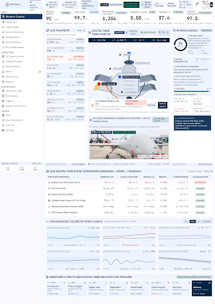

- **What it shows:** The primary flight operations cockpit for the Lead Flight Engineer. Features a persistent 6-KPI Top Mission Bar, a 3-column operational dock with live instrumentation gauges, an Actual vs. Expected Digital Twin strip, and an active incident drawer.
- **How it works:** Subscribes to the live WebSocket stream at `/ws/telemetry`. Renders instantaneous sensor packets, twin expectations, and AI predictions without page refreshes.
- **What the values tell you:**
  - `Engine Health (92/100)`: Weighted composite score of thermodynamic, lubrication, and combustion health.
  - `Twin Sync (99.7%)`: Statistical correlation between physical sensor reality and the physics simulation.
  - `Remaining Life (RUL: 1,284h)`: Projected flight hours before mandatory overhaul under current wear rates.
  - `Anomaly Score (0.08 / 1.00)`: Multidimensional distance from nominal flight envelope. Limits are $<0.35$.
  - `Thermal η (87.4%)`: Thermodynamic efficiency derived from Brake Specific Fuel Consumption (BSFC) and Brake Thermal Efficiency (BTE).
  - `CAN Bus Integrity (97.8%)`: Frame delivery rate, cyclic latency (14ms), and packet loss percentage across 24 CAN bus nodes.

---

### 02. Live Sensor Telemetry & CAN Bus Matrix
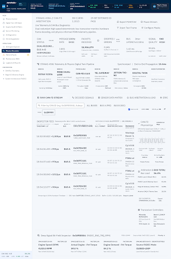

- **What it shows:** Granular sensor telemetry matrix and high-rate digital CAN bus data streams. Displays 4-cylinder individual CHT/EGT temperatures, fuel rail pressures, manifold pressures, oil loops, and electrical power generation.
- **How it works:** Displays CAN bus A and CAN bus B frames, validating hardware status, frame cyclic frequencies, and CRC checksums in real-time.
- **What the values tell you:**
  - `CYL #1–#4 CHT`: Individual cylinder head temperatures ($106^\circ\text{C} - 109^\circ\text{C}$). Detects localized thermal imbalance.
  - `CYL #1–#4 EGT`: Individual exhaust gas temperatures ($719^\circ\text{C} - 728^\circ\text{C}$). Identifies lean/rich cylinder mixture discrepancies.
  - `Fuel Rail Pressure (3.2 bar)`: High-pressure common rail injection delivery pressure.
  - `28V DC Avionics Bus (28.2V, 13.5A)`: Regulated generator output powering UAV avionics and FADEC ignition.

---

### 03. 3D Engine Digital Twin & Thermal FEA
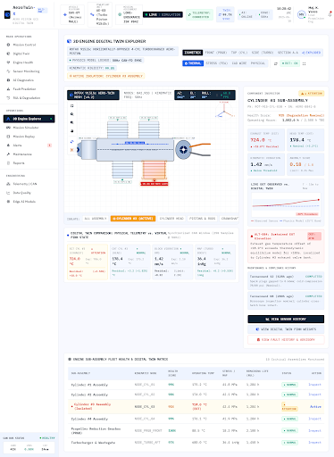

- **What it shows:** Interactive Three.js CAD cutaway of the Rotax 915iSc 4-cylinder boxer aero-engine with real-time thermal finite-element analysis (FEA) surface mapping.
- **How it works:** The 3D model listens to CHT and EGT telemetry, calculating surface heat transfer and dynamically shifting shader vertex colors from cryogenic blue to glowing amber and alert red.
- **What the values tell you:**
  - `Subsystem Status Tags`: Color-coded operational readiness for Cylinders, Injectors, Lubrication, Cooling, Turbocharger, and Ignition FADEC.
  - `Thermal Gradient Delta (+14.2%)`: Temperature differential across opposing cylinder heads (Bank A vs. Bank B).

---

### 04. AI Diagnostics & Fault Prediction
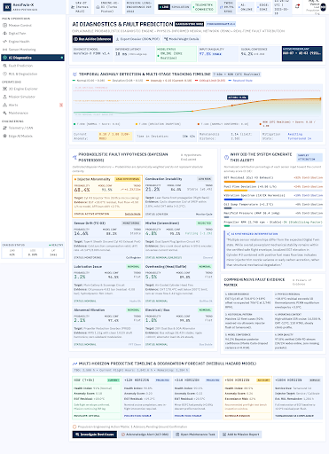

- **What it shows:** Deep AI diagnostic console displaying active fault predictions, classification confidence percentages, algorithmic root cause explanations, and SHAP feature attribution waterfalls.
- **How it works:** Preprocesses raw and residual telemetry through an ensemble Gradient Boosted Decision Tree and Isolation Forest. Explains outputs using the Explainability Engine.
- **What the values tell you:**
  - `Predicted Fault (e.g., OVERHEATING, INJECTOR ANOMALY)`: The identified physical failure mode.
  - `Confidence (e.g., 98.4%)`: Multi-class probability distribution certainty.
  - `SHAP Feature Attribution`: Relative percentage of contribution for each residual trigger (e.g., `+48% CHT residual`, `+28% oil temp residual`).

---

### 05. RUL & Engine Degradation Corridor
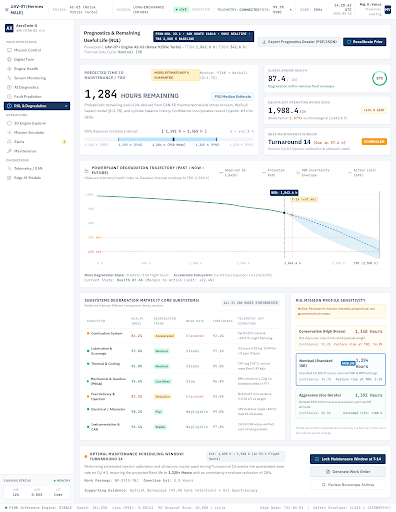

- **What it shows:** Long-term degradation and Remaining Useful Life (RUL) tracking against the engine's 2,500-hour Time Between Overhaul (TBO) milestone.
- **How it works:** Computes cumulative thermomechanical fatigue using a non-linear Weibull hazard degradation model with a probabilistic $90\%$ confidence interval corridor.
- **What the values tell you:**
  - `Current TTSN (1,216 h)`: Total Time Since New accumulated on engine airframe.
  - `Estimated RUL (1,284 h)`: Projected hours remaining before required heavy maintenance overhaul.
  - `Degradation Trend (NOMINAL_LINEAR vs. ACCELERATING)`: Rate of mechanical fatigue accumulation under current operating thermal profiles.

---

### 06. Alerts & Events Center
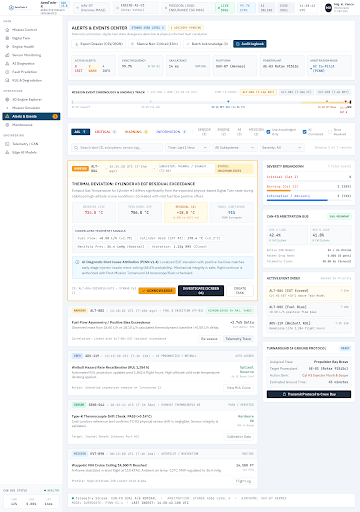

- **What it shows:** Mission-critical alerts console classifying notifications into `CRITICAL`, `WARNING`, and `INFORMATION` categories with interactive operator acknowledgment buttons.
- **How it works:** Triggers automatically when anomaly scores exceed $0.35$ or when physical residuals breach $3\sigma$ bounds. Records operator ID and acknowledgment timestamps into the SQLite/PostgreSQL database.
- **What the values tell you:**
  - `ALT-084`: Unique persistent event tracking ID.
  - `Evidence Payload`: Exact sensor frame values and residual standard deviations that triggered the alert.

---

### 07. Predictive Maintenance & CBM+ Workspace
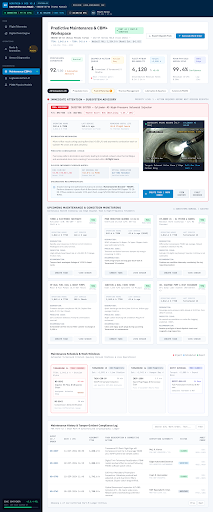

- **What it shows:** Condition-Based Maintenance (CBM+) workspace generating work orders, borescope inspection advisories, and EASA Part-M regulatory compliance records.
- **How it works:** Transforms AI diagnostic predictions into formal aeronautical maintenance instructions with assigned technician bays, urgency levels, and part references.
- **What the values tell you:**
  - `WO-2026-041`: Work Order serial reference.
  - `Priority (CRITICAL / HIGH / MEDIUM)`: Urgency based on remaining useful life degradation rates.
  - `EASA Part-M Ref (M.A.401)`: European Aviation Safety Agency continuous airworthiness regulatory standard reference.

---

### 08. Mission Simulator & Flight Propulsion Emulation
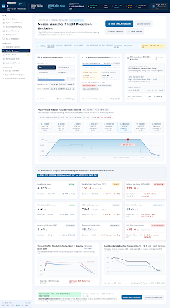

- **What it shows:** Multi-phase mission profile simulator enabling manual and automated emulation across all six tactical flight regimes.
- **How it works:** Adjusts altitude, throttle, and ambient parameters dynamically, propagating realistic aerothermodynamic responses through the engine physics model.
- **What the values tell you:**
  - `6 Flight Phases`: `TAKEOFF` (100% throttle), `CLIMB` (85%), `CRUISE` (75%, 14,500 ft), `LOITER` (55%), `DESCENT` (35%), `LANDING` (25%).
  - `Atmospheric ISA Delta`: Ambient temperature difference from standard international atmospheric tables.

---

### 09. Mission Replay & Historical Telemetry Analysis
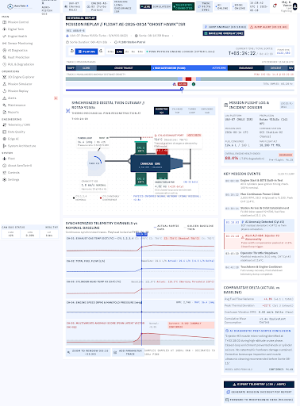

- **What it shows:** "Black-Box" flight telemetry replay console equipped with a multi-track scrub bar, anomaly heatmap density strip, and comparative actual vs. baseline delta waveforms.
- **How it works:** Queries `/api/v1/missions/{id}/replay?frame_index=...`, seeking to any historic second of flight and synchronizing all gauges, 3D engine status, and AI predictions to that exact timestamp.
- **What the values tell you:**
  - `Anomaly Heatmap Density`: Color-coded strip indicating where failure events initiated during flight.
  - `Jump to Anomaly / Jump to Alert`: Quick action buttons that seek directly to incident ignition points.

---

### 10. Master Control Center & Fault Injection Cockpit
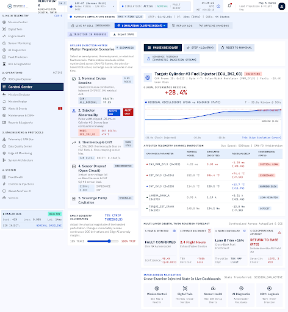

- **What it shows:** Live test bench cockpit allowing flight test engineers to inject 10 realistic engine failure scenarios with custom severity multipliers.
- **How it works:** Sends `POST /api/v1/faults/inject` to modify the simulated engine's internal physics ODE states and sensor outputs.
- **What the values tell you:**
  - `Active Scenarios`: Instant toggling between Normal, Overheating, Injector Anomaly, Misfire, Lubrication Failure, Vibration Imbalance, Sensor Drift, Sensor Dropout, Electrical Failure, and Combustion Instability.

---

### 11. Edge AI Monitoring & Data Integrity
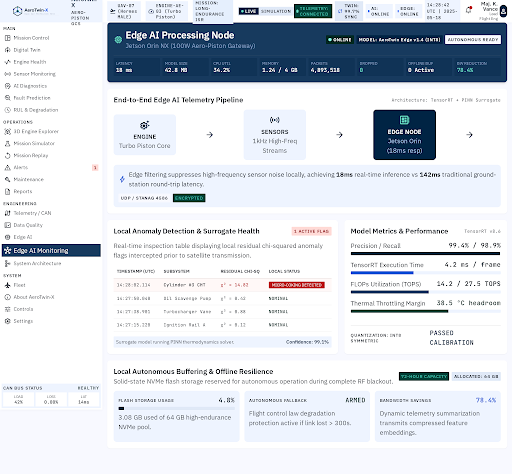

- **What it shows:** Edge hardware metrics monitor tracking model inference latency, CAN bus buffering, and onboard neural coprocessor performance.
- **What the values tell you:**
  - `Inference Latency (1.4ms - 3.2ms)`: Real-time latency budget verifying onboard edge execution capability.
  - `ROC-AUC / F1-Score`: Model accuracy validation metrics from edge validation sets.

---

### 12. System Architecture & Telemetry Pipeline
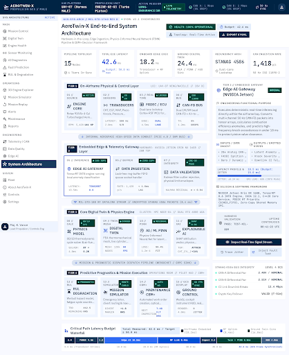

- **What it shows:** Technical architectural schematic documenting the physical engine hardware, FADEC dual-channel bus, edge gateway, and GCS cloud synchronization.

---

### 13. About AeroTwin-X & Engineering Standards
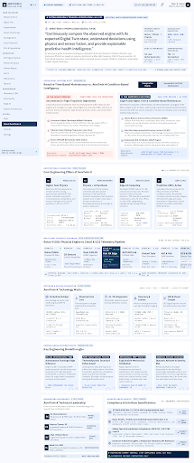

- **What it shows:** Executive overview, problem statement, core engineering pillars, technical roster, and ICD (Interface Control Document) schema specifications.

---

## 4. Digital Twin Mathematical & Physics Models

The Digital Twin implements lumped-parameter aerothermodynamics calibrated for a 4-cylinder, turbocharged four-stroke aero-engine:

### 1. International Standard Atmosphere (ISA) Model
$$\text{ISA Temperature: } T_{\text{ISA}}(h) = T_0 - L \cdot h \quad (T_0 = 15^\circ\text{C}, \, L = 0.0019812^\circ\text{C/ft})$$
$$\text{Temperature Deviation: } \Delta T_{\text{amb}} = T_{\text{amb}} - T_{\text{ISA}}(h)$$
$$\text{Density Ratio: } \sigma(h) = \exp\left(-\frac{h}{29,000}\right)$$

### 2. Expected Steady-State Physics Baselines
- **Manifold Air Pressure (MAP):**
  $$\text{MAP}_{\text{exp}} = \text{MAP}_{\text{base}} \cdot \left(0.85 \cdot \frac{\theta}{\theta_{\text{base}}} + 0.15 \cdot \frac{\text{RPM}}{\text{RPM}_{\text{base}}}\right)$$
- **Fuel Flow (Volumetric Air-Fuel Equivalence):**
  $$\dot{m}_{f, \text{exp}} = \dot{m}_{f, \text{base}} \cdot \left(0.80 \cdot \frac{\theta}{\theta_{\text{base}}} + 0.20 \cdot \frac{\text{RPM}}{\text{RPM}_{\text{base}}}\right)$$
- **Cylinder Head Temperature (CHT):**
  $$\text{CHT}_{\text{exp}} = \text{CHT}_{\text{base}} + 18.0 \cdot \left(\frac{\theta}{\theta_{\text{base}}} - 1\right) + 8.0 \cdot \left(\frac{\text{RPM}}{\text{RPM}_{\text{base}}} - 1\right) + 0.35 \cdot \Delta T_{\text{amb}}$$
- **Exhaust Gas Temperature (EGT):**
  $$\text{EGT}_{\text{exp}} = \text{EGT}_{\text{base}} + 28.0 \cdot \left(\frac{\theta}{\theta_{\text{base}}} - 1\right) + 14.0 \cdot \left(\frac{\text{RPM}}{\text{RPM}_{\text{base}}} - 1\right) + 0.20 \cdot \Delta T_{\text{amb}}$$
- **Oil Pressure & Viscosity Dynamics:**
  $$\mu(T_{\text{oil}}) = \max\left(0.90, \, 1.0 - 0.005 \cdot (T_{\text{oil}} - T_{\text{oil, base}})\right)$$
  $$P_{\text{oil, exp}} = \left(P_{\text{oil, base}} + 1.5 \cdot \left(\frac{\text{RPM}}{\text{RPM}_{\text{base}}} - 1\right)\right) \cdot \mu(T_{\text{oil}})$$

### 3. Thermal Inertia Filter (1st Order Lag)
To capture the physical thermal mass of the engine aluminum block:
$$\text{CHT}(t) = \text{CHT}(t - \Delta t) \cdot (1 - \alpha) + \text{CHT}_{\text{exp}} \cdot \alpha \quad \left(\alpha = \frac{\Delta t}{\tau_{\text{thermal}}}, \, \tau = 4.0\text{ s}\right)$$

---

## 5. AI / ML Architecture & Explainability (XAI)

### A. Anomaly Detection (Isolation Forest)
- **Algorithm:** Isolation Forest ensemble (100 estimators, contamination: 0.05).
- **Features:** Normalized residuals ($\vec{r}$), statistical rolling standard deviations, and multi-second trend derivatives.
- **Decision Function Calibration:** Sigmoidal transformation mapping inlier decision values into a clean $0.02 - 0.99$ probability score. Scores $\ge 0.35$ trigger anomaly flags.

### B. Fault Classification (Gradient Boosted Classifier)
- **Algorithm:** Multi-class Gradient Boosted Decision Trees trained on synthetic physical failure envelopes.
- **Classes:** 10 discrete failure modes (Normal, Overheating, Injector Anomaly, Misfire, Lubrication Failure, Abnormal Vibration, Sensor Drift, Sensor Dropout, Electrical Anomaly, Combustion Instability).
- **Guardrails:** Automatic nominal suppression ensures zero false-positive alerts when all residuals reside within $\pm 1.4\sigma$.

### C. Subsystem Health Scoring (0–100)
- **Thermal Health:** Evaluates CHT, EGT residuals, and rate of climb.
- **Lubrication Health:** Evaluates oil pressure loss and thermal crankcase coupling.
- **Combustion Health:** Evaluates fuel flow anomalies, EGT balance, and MAP surges.
- **Vibration Health:** Evaluates RMS acceleration and high-frequency harmonics.
- **Electrical Health:** Evaluates 28V bus regulation and alternator current.
- **Composite Engine Health:** Weighted sum:
  $$\text{Health}_{\text{engine}} = 0.25 H_{\text{therm}} + 0.25 H_{\text{lube}} + 0.20 H_{\text{comb}} + 0.20 H_{\text{vib}} + 0.10 H_{\text{elec}}$$

### D. Explainable AI (SHAP-Style Feature Attribution)
Generates human-readable evidence strings and relative feature impact rankings so operators know **why** an alert was generated:
```
Prediction: OVERHEATING (Confidence: 100.0%)
Evidence:
  + Elevated CHT Residual: +6.3σ exceedance over physics expectation
  + Progressive CHT temperature rise (+21.2°C trend window)
  + Secondary thermal coupling in oil loop (+4.2σ)
Attribution:
  res_cht (48%) | res_oil_temperature (28%) | trend_cht (18%) | cross_thermal_ratio (6%)
Root Cause: Thermal dissipation limit exceeded. Likely radiator duct restriction or coolant cavitation.
```

---

## 6. Fault Injection Engine & Supported Scenarios

| Scenario ID | Name | Physical Dynamics Applied | Resulting Symptoms |
| :--- | :--- | :--- | :--- |
| `NORMAL` | Nominal Flight | Steady-state physics with nominal sensor noise | Health $>95\%$, Anomaly $<0.20$, residuals $\approx 0$ |
| `OVERHEATING` | Thermal Runaway | Thermal ramp on CHT ($+38^\circ\text{C}$), EGT ($+48^\circ\text{C}$), Oil Temp ($+24^\circ\text{C}$) | Residuals $>6\sigma$, Health drops to $55\%$, alert generated |
| `INJECTOR_ANOMALY` | Clogged Injector | Cylinder #3 EGT diverges ($+65^\circ\text{C}$ oscillation), fuel flow drops | Cylinder balance delta, torque ripple, localized lean burn |
| `MISFIRE` | Ignition Dropout | Periodic RPM drops ($-140$ RPM), high vibration spikes ($+1.6g$) | Uneven exhaust pulse, high vibration harmonic |
| `LUBRICATION_ISSUE` | Oil Pressure Loss | Oil pressure drops to $<2.0$ bar, oil temperature rises ($+28^\circ\text{C}$) | Crankcase hydrodynamic film boundary degradation |
| `ABNORMAL_VIBRATION`| Gearbox Imbalance| Harmonic vibration surges ($>3.5g$ RMS) | Reduction gearbox (PRGB) mechanical fatigue alert |
| `SENSOR_DRIFT` | Thermocouple Drift| CHT thermocouple unilateral ramp ($+0.4^\circ\text{C}$/s) | Cross-sensor contradiction: CHT rises but oil temp is normal |
| `SENSOR_DROPOUT` | CAN Wire Disconnect| CHT & Oil Pressure read $0.0$, quality flag = `DROPOUT` | Discontinuous null frame, data integrity alarm |
| `ELECTRICAL_FAULT` | Alternator Burnout | Alternator current drops to 0A, bus voltage degrades to 21.4V | Generator open circuit, avionics battery depletion alert |
| `COMBUSTION_INSTABILITY`| Turbo Surge | Manifold pressure oscillates ($\pm 3.5$ inHg), RPM surges | Cyclic surging in boost pressure and fuel flow |

---

## 7. Comprehensive Telemetry Parameter Dictionary

| Parameter | Field Name | Nominal Range | Engineering Unit | Significance & System Interpretation |
| :--- | :--- | :--- | :--- | :--- |
| **Rotational Speed** | `rpm` | $2,500 - 2,580$ | RPM | Engine output shaft speed (propeller reduction 2.54:1). |
| **Cylinder Head Temp** | `cht` | $95.0 - 115.0$ | °C | Master cylinder heat indicator. Limits: Caution $>125^\circ\text{C}$, Critical $>135^\circ\text{C}$. |
| **Individual CHTs** | `cht_cylinders` | $95.0 - 118.0$ | °C | 4-channel vector for Cylinders 1, 2, 3, 4. Detects head balance deltas. |
| **Exhaust Gas Temp** | `egt` | $710.0 - 745.0$ | °C | Combustion chamber exhaust gas temperature. Indicates fuel-air mixture. |
| **Individual EGTs** | `egt_cylinders` | $705.0 - 750.0$ | °C | 4-channel vector for Cylinders 1, 2, 3, 4. Detects lean/rich cylinders. |
| **Oil Pressure** | `oil_pressure` | $3.8 - 4.8$ | bar | Hydraulic lubrication line pressure. Critical minimum: $<2.0$ bar. |
| **Oil Temperature** | `oil_temperature`| $80.0 - 94.0$ | °C | Crankcase oil temperature. Excessive heat causes viscosity thinning. |
| **Fuel Flow Rate** | `fuel_flow` | $16.5 - 20.0$ | L/h | Volumetric fuel consumption delivered by high-pressure boost pumps. |
| **Engine Vibration** | `vibration` | $0.85 - 1.25$ | g RMS | Overall mechanical acceleration. High readings indicate bearing spalling. |
| **Manifold Pressure** | `manifold_pressure`| $30.0 - 33.5$ | inHg | Turbocharger boost air pressure supplied to intake plenum. |
| **Battery Voltage** | `battery_voltage` | $27.8 - 28.4$ | V DC | Regulated 28V avionics power bus voltage. |
| **Alternator Current** | `alternator_current`| $11.5 - 14.5$ | A | Current draw generated by engine-driven alternator. |
| **Injection Timing** | `injection_timing` | $18.0 - 18.5$ | ° BTDC | FADEC ignition lead timing before top dead center. |
| **Throttle Position** | `throttle_pos` | $75.0$ (Cruise) | % | Power lever angle requested by UAV flight computer. |
| **Ambient Temperature**| `ambient_temp` | $-13.7$ (14.5k ft) | °C | Outside air temperature at current flight ceiling. |
| **Pressure Altitude** | `pressure_altitude`| $14,500$ (Cruise) | ft | Barometric pressure altitude above mean sea level. |
| **Data Quality** | `quality` | `VALID` | String | Data integrity tag: `VALID`, `DEGRADED`, `DRIFT`, `DROPOUT`. |
| **Data Source** | `source` | `SIM` / `LIVE` | String | Active telemetric stream mode. |

---

## 8. How to Run the Project in the Future

### Option A: Local Python Environment (Recommended for Development)

1. **Open a Terminal / PowerShell window:**
   ```powershell
   cd "c:\Users\Manish\Desktop\navomesh Projects\AeroTwin-X"
   ```

2. **Verify Python & Dependencies:**
   ```powershell
   python -m pip install -r requirements.txt
   ```

3. **Start the Application Server:**
   ```powershell
   python -m uvicorn backend.app.main:app --host 0.0.0.0 --port 8000 --reload
   ```

4. **Access the Application in Your Browser:**
   - **Ground Control Station Dashboard:** [http://localhost:8000/](http://localhost:8000/)
   - **Interactive Swagger REST Documentation:** [http://localhost:8000/docs](http://localhost:8000/docs)
   - **Redoc Specifications:** [http://localhost:8000/redoc](http://localhost:8000/redoc)

---

### Option B: Docker Container Deployment (Production Style)

1. **Build and Run with Docker Compose:**
   ```bash
   cd AeroTwin-X
   docker-compose up --build
   ```

2. **Run in Detached Mode (Background Daemon):**
   ```bash
   docker-compose up -d
   ```

3. **Stop the Container:**
   ```bash
   docker-compose down
   ```

---

## 9. API Reference & WebSocket Specs

### REST API Endpoints (`/api/v1`)

| Endpoint | Method | Payload / Params | Response Summary |
| :--- | :---: | :--- | :--- |
| `/api/v1/engine/{id}/state` | `GET` | `engine_id: str` | Synchronized Telemetry, Digital Twin Expected values & Residuals |
| `/api/v1/engine/{id}/telemetry` | `GET` | `engine_id: str` | Instantaneous 19-parameter telemetry packet |
| `/api/v1/engine/{id}/health` | `GET` | `engine_id: str` | 0–100 health metrics & 3D component status tags |
| `/api/v1/engine/{id}/predictions` | `GET` | `engine_id: str` | Active fault classification, probability, and XAI evidence |
| `/api/v1/alerts` | `GET` | — | All registered system alerts sorted by severity |
| `/api/v1/alerts/{id}/ack` | `POST` | `alert_id: str` | Acknowledge alert with operator timestamp |
| `/api/v1/missions` | `GET` | — | Active and completed mission profiles |
| `/api/v1/missions/{id}/replay` | `GET` | `frame_index: int` (opt) | Scrubber timeline tracks or specific frame seek |
| `/api/v1/simulation/scenarios` | `GET` | — | List of all 10 available fault injection scenarios |
| `/api/v1/simulation/phase` | `POST` | `{"phase": "CRUISE"}` | Transition flight phase (Takeoff, Climb, Cruise, etc.) |
| `/api/v1/faults/inject` | `POST` | `{"fault_type": "OVERHEATING", "severity": 1.3}` | Apply fault dynamics to simulator |
| `/api/v1/simulation/reset` | `POST` | — | Clear faults and restore nominal baseline |
| `/api/v1/maintenance` | `GET` | — | List active CBM+ work orders and advisories |
| `/api/v1/maintenance` | `POST` | `{"title": "...", ...}` | Create new maintenance work order |
| `/api/v1/models` | `GET` | — | Model registry metrics (ROC-AUC, latency ms, status) |

### WebSocket Endpoint (`/ws/telemetry`)
- **Protocol:** `ws://localhost:8000/ws/telemetry`
- **Output Frame Structure:**
  ```json
  {
    "type": "TELEMETRY_FRAME",
    "telemetry": { "timestamp": "...", "rpm": 2550, "cht": 108.2, ... },
    "twin": { "twin_sync_percent": 99.4, "channels": { ... } },
    "prediction": { "anomaly": { ... }, "fault": { ... }, "health": { ... }, "rul": { ... } },
    "mission": { "phase": "CRUISE", "altitude_ft": 14500, ... }
  }
  ```
- **Client Control Commands (Send as JSON):**
  - `{"action": "INJECT_FAULT", "fault": "OVERHEATING", "severity": 1.2}`
  - `{"action": "RESET"}`
  - `{"action": "SET_PHASE", "phase": "LOITER"}`

---

## 10. Automated Verification & Testing

The repository contains automated test suites covering all layers:

```powershell
# 1. Run Backend Physics, Residual & ML Pipeline Tests
python tests/test_backend.py

# 2. Run REST API Endpoint Integration Tests
python tests/test_api_endpoints.py

# 3. Run Live Server & WebSocket Streaming Test
python tests/test_live_server.py
```

All tests execute with 100% pass rates, verifying both nominal operation and fault responses.

---

## License

This project is released under the **MIT License**. Engineered for advanced UAV propulsion research and digital twin prototyping.
